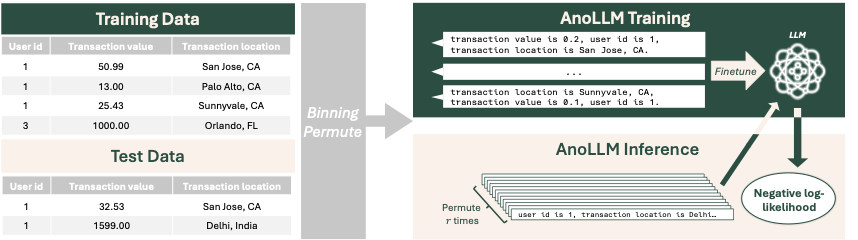

# AnoLLM: Large Language Models for Tabular Anomaly Detection (ICLR 2025)

<p align="center">
  <a href="https://github.com/amazon-science/tabsyn/blob/main/LICENSE">
    
  </a>
  <a href="https://openreview.net/forum?id=7VkHffT5X2">
    
  </a>
</p>

This repository contains the implementation of the paper:
> **AnoLLM: Large Language Models for Tabular Anomaly Detection**  <br>
> International Conference on Learning Representations (ICLR 2025)<br>
> Che-Ping Tsai, Ganyu Teng, Phil Wallis, Wei Ding. <br>

## Introduction

<div align="center">
  
  <br>
  <br>
</div>
AnoLLM is a novel framework that leverages large language models (LLMs) for unsupervised tabular anomaly detection. It can effectively handle mixed-type tabular data (e.g., continuous/numerical, discrete/categorical, and texts) by adapting a pre-trained LLM with serialized tabular data in the text format. During inference, AnoLLM assigns anomaly scores based on the negative log-likelihood generated by the LLM. Our empirical results indicate that AnoLLM delivers the best performance on six benchmark datasets with mixed feature types.


## Installing Dependencies

Python version: 3.10


Create environment

```
conda create -n anollm python=3.10
conda activate anollm
```

Install packages

```
pip install -r requirements.txt
```

Install Torch, ensuring that the version you choose is compatible with your CUDA version.
```
pip install torch==2.3.1
```

Overwrite pyod version to avoid bugs
```
pip install pyod==2.0.1
```

## Rerun our experiments

1. Download the following datasets from Kaggle and put them to ``data/[dataset_name]/``
   - [vifd](https://www.kaggle.com/datasets/khusheekapoor/vehicle-insurance-fraud-detection/data) (Vehicle Insurance Fraud Detection)  
   - [fraudecom](https://www.kaggle.com/datasets/vbinh002/fraud-ecommerce/data) (Fraud E-commerce)
2. Run the corresponding scripts for each experiment:
   ```
   bash scripts/exp1-mixed_benchmark/run_anollm.sh
   bash scripts/exp1-mixed_benchmark/run_baselines.sh
   bash scripts/exp2-odds/run_anollm.sh
   bash scripts/exp2-odds/run_baselines.sh
   bash scripts/exp3-binning_effect/run_binning_odds.sh
   bash scripts/exp4-model_size/run_anollm_1.7B_mixed.sh
   bash scripts/exp4-model_size/run_anollm_1.7B_odds.sh
   ```

## Using your own datasets

To use a custom dataset, create a dataframe with the following structure: ``{feature_name:feature_values}``. Please refer to ``load_dataset()`` function in ``src/data_utils.py`` for further guidance.

### Training Models

For AnoLLM, we use the following command:

```
CUDA_VISIBLE_DEVICES=$TRAIN_GPUS torchrun --nproc_per_node=$n_train_node train_anollm.py --dataset $dataset --n_splits $n_splits --split_idx 0  --binning standard --setting semi_supervised --max_steps 2000 --batch_size $batch_size --model $model
```
Check the argument parser in ``train_anollm.py`` for options for datasets and models

For baselines, we use the following command:

```
CUDA_VISIBLE_DEVICES=0 python evaluate_baselines.py --dataset $dataset --n_splits $n_splits --normalize  --setting  semi_supervised --split_idx $split_idx 
```

Check the argument parser in ``evaluate_baselines.py`` for options for datasets 

### Evaluation

To evaluate AnoLLM, we use the following command:
```
CUDA_VISIBLE_DEVICES=$INFERENCE_GPUS  torchrun --nproc_per_node=$n_test_node evaluate_anollm.py --dataset $dataset --n_splits $n_splits --split_idx 0  --setting semi_supervised --batch_size $eval_batch_size  --n_permutations $n_permutations --model $model --binning standard  
``` 

We evaluate the quality of synthetic data using metrics from various aspects.
```
python src/get_results.py --dataset $dataset --n_splits $n_splits --setting semi_supervised
```

## License

This project is licensed under the Apache-2.0 License.

## Acknowledgement
Baselines were adapted from https://github.com/vicliv/DTE. Part of the code was adapted from https://github.com/kathrinse/be_great. Thanks to all the authors for their great works!

## Reference

```
@inproceedings{tsai2025anollm,
  title={AnoLLM: Large Language Models for Tabular Anomaly Detection},
  author={Tsai, Che-Ping and Teng, Ganyu and Wallis, Phil and Ding, Wei},
  booktitle={The thirteenth International Conference on Learning Representations},
  year={2025},
  note={Accepted, to appear},
}
```


